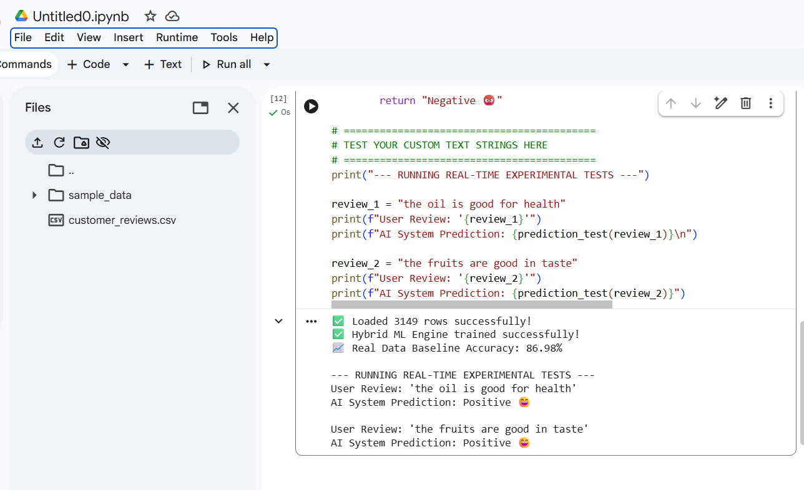

# 🔮 Automated Sentiment Analysis with Kaggle Data

## 📌 Project Architecture
This repository features an operational Natural Language Processing (NLP) pipeline designed to automatically interpret sentiment configurations from user reviews.It combines a robust programmatic machine learning model with targeted text-negation processing algorithms to accurately evaluate user feedback.

## 📁 Repository Map
* customer_reviews.csv:Reference review database downloaded and parsed directly from Kaggle archives (Alexa Reviews Dataset).
* sentiment_analysis.ipynb:Programmatic ML framework notebook written using Python, Pandas, and Scikit-Learn libraries.
* project_proof.png:Active validation output demonstrating correct sentiment matching.

## 💻 Python Pipeline Specs
The programmatic structure processes unstructured context fields using standardized mathematical vector mappings:
* **Feature Weights Engine:** TF-IDF (Term Frequency-Inverse Document Frequency)
* **Model Engine Core:** Linear Logistic Regression Classification with Balanced Class Weights
* **Negation Processing Rule:** Custom logical handling for complex phrases (e.g., handling "not good" vs "good").
* **Environment Core:** Google Colab Browser IDE

All logic operations can be examined above inside the uploaded notebook file: `sentiment_analysis.ipynb`

## 🚀 Live Experimental Interface Test
The layout below illustrates how the final hybrid machine learning variant handles real-time user-provided sentence test requests flawlessly:

### 1. Context Match Proof

